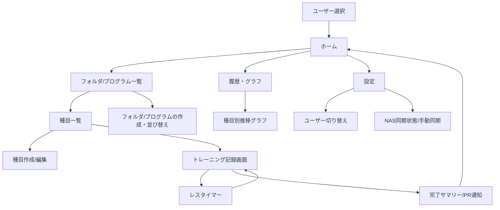
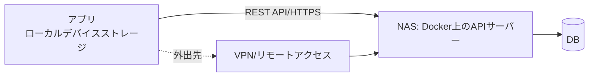

# 筋トレ記録アプリ 仕様書

2026-09-19 · @そーいち

## 概要・目的

既存の筋トレ記録アプリは種目のマスタが固定されており、自分の使いたい種目名・部位・器具の組み合わせで自由に登録できないことが多い。本アプリは「種目設定の自由度の高さ」を最大の価値とし、利用者が自分のトレーニングスタイルに合わせて種目・記録項目・グルーピングを自由にカスタマイズできる筋トレ記録アプリを提供する。

想定ユーザーは本人に加えて家族など複数人。データはSynology NAS上に保存し、自宅・外出先(ジムなど)の両方で記録・閲覧できることを目指す。

## MVP機能一覧

| 機能 | 内容 |
| --- | --- |
| 基本の記録 | 種目・重量×回数をセット単位で記録、RMも自動表示 |
| 前回値表示 | 同じ種目の前回記録を自動表示し、差分入力でのだけ入力できる |
| レスタイマー | セット間の休憩時間をカウントダウン表示・通知 |
| 履歴・グラフ表示 | 重量推移やボリューム(重量×回数×セット数)の推移をグラフで表示 |
| 自己ベスト更新通知(PR) | 最高重量・最高回数・最高ボリュームを更新した際に通知 |

### フェーズ2以降の候補(参考)

- トレーニングプログラムの自動提案・進捗管理
- 他ユーザーとの記録比較・共有機能の強化
- ウェアラブル連携(心拍数など)→Apple Watch

## 種目管理仕様

本アプリの中核機能。種目はマスタデータではなく全てユーザーが自由に作成・編集できる。
マスターデータはある程度用意しておき、そこにない場合はユーザーが自由に作成・編集できる。

### 種目の基本情報(自由入力)

| 項目 | 内容 |
| --- | --- |
| 種目名 | 自由テキスト入力(既定リストなし) |
| 部位 | 自由テキスト入力または選択(胸・背・肩・腕・脚・尻・全身など)を自由に追加可能 |
| 使用器具 | 自由テキスト入力(バーベル・マシン・自重など) |

### 種目ごとの記録項目カスタマイズ

デフォルトは重量×回数だが、種目作成時に記録項目を選択できる。

| 記録項目 | 向いている種目例 |
| --- | --- |
| 重量 × 回数 | ベンチプレスなど一般的な筋トレ種目 |
| 時間 | プランクなどアイソメ系 |
| 距離 | ランニング・ロウイングなど有酸素系 |
| RPE(主観的運動強度) | 高強度トレーニングの負荷管理 |
| メモ(フリーテキスト) | フォームの気づき等を自由記述 |

- 複数項目の組み合わせも可(例: 重量×回数×RPE)
- MVPでは上記の組み合わせのみ。ユーザー自定義項目はフェーズ2以降で検討

### 並び替え・複製・テンプレート化

- 種目の表示順はドラッグで並び替え可能
- 既存種目を複製して新規種目のベースにできる
- よく使う種目セットを「テンプレート」として保存し、次回以降はそこから選んで開始できる

### フォルダ/プログラムでのグループ化

「胸の日」「脚の日」「背中・二頭日」のように、種目をフォルダ(プログラム)単位でまとめられる。フォルダはユーザーが自由に作成・名前変更し、1種目を複数フォルダに所属させることも可能とする。

## トレーニング記録画面の仕様

### 入力フロー

1. フォルダ/プログラムまたは種目リストから種目を選択
2. 選択した種目の直近の記録(前回日付・各セットの重量×回数など)を自動表示
3. ユーザーは変更がある部分のみ入力(差分入力)。値を変えなければタップだけで前回と同じ値を確定できる
4. セット完了ごとに「次のセットへ」ボタンでレスタイマーが自動起動
5. 全セット完了後、自己ベストを更新していればその場で通知

### 画面要素(例: 重量×回数種目の場合)

| セット | 前回(自動表示) | 今回(入力) |
| --- | --- | --- |
| 1セット目 | 60kg × 10回 | (空白なら前回値を継承/変更あれば上書き) |
| 2セット目 | 60kg × 9回 | … |

- 重量・回数は数字キーパッドで素早く入力(例: +2.5kg / -1回のステッパーボタン)
- 種目の記録項目設定に応じて入力欄が動的に変わる(時間/距離/RPEなど)

## 画面遷移図

### 主要画面一覧

| 画面 | 役割 |
| --- | --- |
| ユーザー選択 | 起動時に表示。パスワードなしでタップだけで切り替え |
| ホーム | 直近の記録・プログラム一覧・PR通知への入り口 |
| フォルダ/プログラム一覧 | 「胸の日」などのグループ単位で種目一覧へ |
| 種目一覧 | フォルダ内(または全体)の種目を並び替え・選択。新規作成・編集・複製もここから |
| トレーニング記録画面 | 前回値自動表示+差分入力、セット完了でレスタイマー起動 |
| 完了サマリー | その日の記録まとめとPR通知 |
| 履歴・グラフ | 種目別の重量・ボリューム推移グラフ |
| 設定 | ユーザー切り替え、NAS接続設定・手動同期 |

[ワイヤーフレームを見る](https://claude.ai/artifact/D7QQaasNbk8qmBguPBfLrw)(ユーザー選択/ホーム/種目一覧/記録画面/履歴/設定の6画面)

## レスタイマー・Dynamic Island仕様

アプリをバックグラウンド/完全に閉じても休憩タイマーのカウントダウンを継続し、Dynamic Island・ロック画面に残り時間を表示する。

### 要件

| 項目 | 内容 |
| --- | --- |
| カウント継続 | アプリを閉じても休憩時間のカウントダウンが止まらない |
| Dynamic Island表示 | 残り時間をDynamic Islandに常時表示。タップでアプリに戻れる |
| ロック画面表示 | ロック画面にも同様に残り時間を表示 |
| 終了通知 | 休憩終了時に通知。イヤホン(Bluetooth・有線問わず)接続中はアラーム音をイヤホンから再生 |

### 実装方式(方針)

- iOSのLive Activities(ActivityKit)を利用。Live ActivityはOSが直接カウントダウン表示を更新する仕組み(残り時刻ベースのタイマー表示)を持つため、アプリ本体がバックグラウンドで動き続ける必要はない
- React Native本体はActivityKitを標準ではサポートしないため、Swiftで書いたネイティブモジュール(自作またはreact-native-live-activities等のライブラリ)を組み込む
- 休憩終了アラームはカウントダウン開始時にローカル通知(UNUserNotificationCenter)を終了時刻で予約し、サウンド付きで発火させる(アプリがバックグラウンドでも確実に鳴る)
- サウンドは端末のオーディオ出力先(スピーカー/接続中のイヤホン)にiOSが自動でルーティング(アプリ側で接続判定ロジックを作る必要はない)
- Live Activityの最大継続時間(通常8時間程度)は休憩タイマーの用途上制限にならない想定

※AndroidにはDynamic Island相当の機能がないため、将来Android展開する際は通常の通知+フォアグラウンドサービスで代替

## データ保存・同期アーキテクチャ

Synology NASをバックエンドとし、Docker上でAPIサーバーを稼働させる方式を採用する。

### 全体構成

### データフロー

| 状況 | 動作 |
| --- | --- |
| 自宅ネットワーク接続時 | アプリがNAS上のAPIに直接アクセスして読み書き |
| 外出先(ジムなど) | アプリはローカルに一時保存してオフラインでも記録可能 |
| 外出先 + VPN/リモートアクセス接続時 | NASのAPIに直接接続して読み書き(自宅接続時と同じ挙動) |
| アプリ起動時 | 未同期のローカル変更を検知し、NASと自動で差分同期(ユーザー操作不要) |

### 構成要素(例)

| 要素 | 内容 |
| --- | --- |
| サーバー | Dockerコンテナとして NAS上で稼働(Node.js + Express で確定) |
| DB | SQLiteをNASボリューム上のファイルとして永続化 |
| 通信 | REST API over HTTPS(自宅・VPN経由とも同一エンドポイント) |
| 外部接続 | Synology VPN Serverパッケージを利用(NAS自体がVPNサーバー) |

- NASサーバーの具体的な実装方法は未確定(「今後決めること」参照)
- 衝突解決は最後に保存した方で上書き(Last Write Wins)で確定

## マルチユーザー対応

家族など複数人で同一NASを共有し、ユーザーごとにデータを完全に分離する。

| 項目 | 方針 |
| --- | --- |
| ユーザー作成 | NASのAPI側でユーザーを登録(人数は少数想定) |
| ログイン | ユーザー選択のみ(パスワードなし)。新規ユーザー追加後は再ログイン時に一覧から選ぶだけ |
| データ分離 | 種目・記録・自己ベストは全てユーザー単位で管理し、他ユーザーのデータは見えない |
| ユーザー切り替え | 同一端末で複数ユーザーを切り替えて使うケース(家族共用端末)はフェーズ2以降で検討 |

※種目テンプレートの家族間共有は不要。各ユーザーのデータは完全に独立したデータとする。

## 技術スタック

| 層 | 候補 | 備考 |
| --- | --- | --- |
| アプリ(クライアント) | React Native | 確定。Dynamic Islandを使いたいため、休憩タイマー部分はLive Activities(ActivityKit)を使うSwiftネイティブモジュールをReact Nativeに組み込む必要あり |
| ローカル保存 | 端末内DB(例: SQLite系) | オフライン時の一時保存・同期キューに使用 |
| 通信 | REST API over HTTPS | NAS上のAPIサーバーと通信 |
| NASサーバー | Dockerコンテナ(例: Node.js + Express等) | Node.js + Expressで確定 |
| DB(NAS側) | SQLite | データ量・同時アクセス数を見て選定 |
| 認証 | ユーザー選択のみ、パスワードなし(MVP) | 少人数利用のため簡易方式で良い見込み。ユーザーを新規追加したら、再ログインでユーザーを選択できる(パスワードはまずは無くてよい) |
| 外部接続 | Synology VPN Serverパッケージ | NASのリモートアクセス機能を活用 |

## API/データベース設計(たたき台)

詳細実装は未確定だが、データ構造のたたき台として以下を想定。

### 主要エンドポイント(例)

| Method | Path | 内容 |
| --- | --- | --- |
| GET | /users | ユーザー一覧(ログイン画面用) |
| GET | /users/:id/folders | フォルダ/プログラム一覧 |
| GET/POST/PUT/DELETE | /users/:id/exercises | 種目の取得・作成・編集・削除 |
| GET/POST | /users/:id/exercises/:exerciseId/logs | 特定種目の記録取得・新規作成 |
| PUT/DELETE | /logs/:logId | 記録の更新・削除 |
| GET | /users/:id/records | 自己ベスト(PR)一覧 |
| POST | /sync | オフライン変更分の一括アップロード(差分同期) |

### 主要テーブル(例)

| テーブル | 主なカラム |
| --- | --- |
| users | id, 名前 |
| folders | id, user_id, 名前, 並び順 |
| exercises | id, user_id, folder_id, 種目名, 部位, 器具, 記録項目定義(JSON) |
| logs | id, exercise_id, 日付, セット番号, 重量, 回数, 時間, 距離, RPEなど(可変項目) |
| personal_records | id, exercise_id, 種別(最高重量/最高回数/ボリューム), 値, 達成日 |

※exercises.記録項目定義をJSONで持つことで、種目ごとの記録項目カスタマイズに柔軟に対応する想定。

## 今後決めること・オープン課題

- [x] (確定)React Nativeを採用。Dynamic Island対応(ActivityKitネイティブモジュール)の具体実装方法は別途検討
- [x] (確定)Node.js + Express + SQLiteを採用
- [x] 認証はユーザー選択のみ(パスワードなし)で確定。将来必要になったらパスワード/トークン方式を検討
- [x] (確定)Synology VPN Serverパッケージを利用し外出先からNASに接続
- [x] (確定)オフライン編集が衝突した場合は最後に保存した方で上書き(Last Write Wins)
- [x] (確定)MVPでは重量・回数・時間・距離・RPEの5種類のみ。ユーザー自定義項目はフェーズ2以降
- [x] (確定)家族間のテンプレート共有は不要。各ユーザーのデータは完全に独立
- [x] (確定)NASの標準バックアップ機能(Hyper Backup等)に任せる。アプリ側の対応は不要
